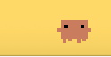
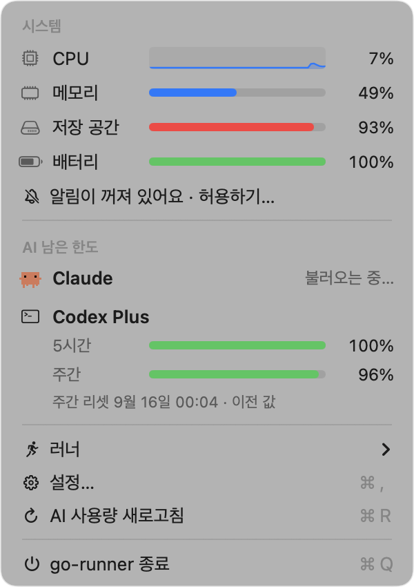
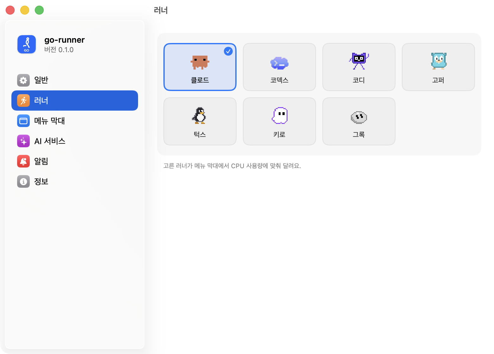
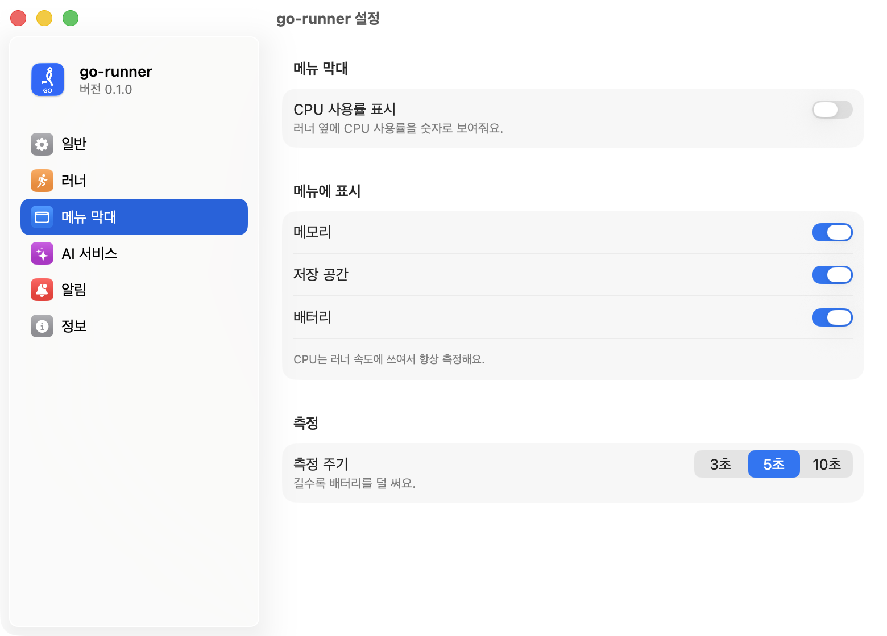
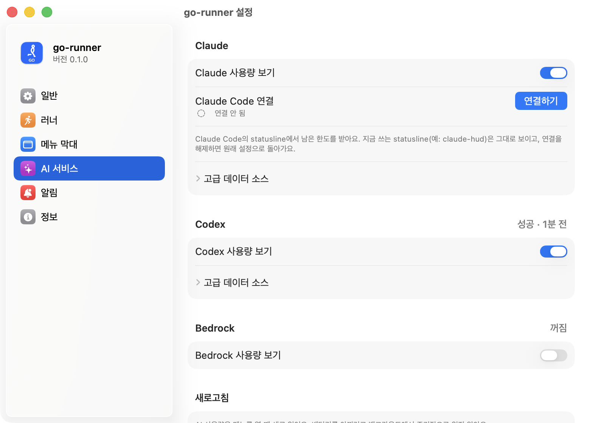

# go-runner

컴퓨터 상태, AI 코딩 도구의 남은 한도, 에이전트 작업 완료를 macOS 메뉴 막대 하나로 알려 주는 앱입니다.
메뉴 막대의 캐릭터가 CPU 사용량에 맞춰 달리고, 누르면 필요한 정보가 한 화면에 모여 있습니다.

    
  

## 왜 만들었나

Claude Code나 Codex에 일을 맡겨 두고 다른 창에서 작업하다 보면 세 가지가 계속 신경 쓰입니다.

- **작업이 끝났나?** 끝났는지 보려고 터미널을 수시로 열어 보게 됩니다.
- **한도가 얼마나 남았나?** 5시간 · 주간 사용 한도는 도구마다 확인하는 방법이 달라서, 한도에 걸린 뒤에야 알게 되곤 합니다.
- **컴퓨터가 버티고 있나?** 빌드나 에이전트가 CPU를 얼마나 쓰는지 따로 창을 열어야 보입니다.

go-runner는 이것들을 항상 보이는 메뉴 막대로 옮겨 왔습니다. 확인하러 가지 않아도 러너가 달리는 속도로 부하를 느끼고,
러너를 한 번 누르면 남은 한도를 보고, 작업이 끝나면 알림을 받습니다.

## 할 수 있는 것

### 메뉴 막대 러너

- CPU를 많이 쓸수록 러너가 빨리 달립니다. 러너 옆에 CPU 사용률 숫자를 함께 띄울 수도 있습니다.
- 캐릭터는 클로드, 코덱스, 코디, 고퍼, 턱스, 키로, 그록 중에서 고릅니다.
- 화면이 꺼져 있거나 저전력 모드일 때는 러너와 측정을 멈춰 배터리를 아낍니다.

### 러너를 누르면 보이는 메뉴

- **시스템**: CPU 최근 사용량 그래프와 메모리 · 저장 공간 · 배터리 막대. 누르면 활성 상태 보기가 열립니다.
  메뉴에 보일 항목과 측정 주기는 설정에서 고릅니다.
- **AI 남은 한도**: Claude · Codex의 5시간 · 주간 남은 %를 막대로 보여 주고, 가장 빠듯한 한도가 언제 초기화되는지 알려 줍니다.
  30% 이하는 주황, 10% 이하는 빨강으로 바뀌며, 새로 읽지 못하면 마지막으로 읽은 값을 보여 줍니다.
- **러너 바꾸기 · 설정 · AI 사용량 새로고침 · 종료**
- **어드민 열기**(선택): 이 Mac의 Secure Enclave 키로 collector에 기기를 증명하고 어드민을 브라우저로 엽니다.
  설정 → 일반 → 기기 신뢰에서 어드민 주소를 넣고, 거기 보이는 thumbprint를 collector의 `COLLECTOR_DEVICE_KEYS`에 추가해야 합니다.

AI 사용량은 메뉴를 열 때만 새로 읽습니다. 배터리를 아끼려고 백그라운드에서 주기적으로 읽지 않습니다.

### 연결할 수 있는 AI 서비스

| 서비스 | 보여 주는 것 | 연결 방법 |
|---|---|---|
| Claude | 5시간 · 주간 남은 한도 | 설정 → AI 서비스 → **Claude Code 연결**. 지금 쓰는 statusline(예: claude-hud)은 그대로 보입니다. |
| Codex | 5시간 · 주간 남은 한도 | Codex CLI가 설치돼 있으면 따로 할 일이 없습니다. |
| AWS Bedrock | 모델별 분당 토큰(TPM) 한도 사용률, 이번 달 비용(선택) | 기본 꺼짐. 설정에서 켜고 AWS 프로필 · 리전을 고릅니다. |

선택 기능으로 Claude Code 로컬 로그에서 오늘 · 최근 7일 토큰과 비용을 추정할 수 있습니다(메모리와 배터리를 더 써서 기본 꺼짐).

### 알림

- **Claude Code · Codex 작업 완료**: 작업이 끝나면 "Claude 작업 완료 · 프로젝트 이름" 같은 macOS 알림을 보냅니다.
  이미 쓰고 있던 훅과 알림 설정은 그대로 두고 go-runner 항목만 추가합니다.
- **Slack 새 메시지**: Dock에 있는 Slack 배지 숫자가 늘면 알려 줍니다. 메시지 내용은 읽지 않습니다(손쉬운 사용 권한 필요).

알림 기록에는 프로젝트 폴더 이름과 시각만 남습니다. 프롬프트나 대화 내용은 저장하지 않습니다.

### 깔끔한 설치와 제거

- 로그인할 때 자동으로 켜지게 할 수 있습니다(설정 → 일반).
- 제거하면 앱이 만든 파일을 모두 지우고, 설치하면서 바꾼 Claude Code · Codex 설정을 원래대로 되돌립니다.

## 설치와 제거

| 하고 싶은 것 | 명령 (프로젝트 폴더에서) |
|---|---|
| 설치하지 않고 바로 실행 | `make run` |
| `~/Applications`에 설치하고 실행 | `./scripts/install.sh` |
| 지울 항목만 확인 | `./scripts/uninstall.sh --dry-run` |
| 완전히 제거 | `./scripts/uninstall.sh` (확인 없이: `--yes`) |

앱 안에서도 지울 수 있습니다: 러너 클릭 → **설정…** → **정보** → **go-runner 제거…**

요구 사항: macOS 14 이상, Swift 6.2 이상(Xcode 또는 Command Line Tools). `swift test`는 XCTest가 들어 있는 Xcode가 있어야 돌아갑니다.
테스트 방법은 [docs/TESTING.md](docs/TESTING.md)에 있습니다.

## 라이선스

Apache License 2.0 — Copyright 2026 gogumang. [LICENSE](LICENSE), [NOTICE](NOTICE)

참고한 오픈소스, 캐릭터와 앱 아이콘의 출처는 [THIRD_PARTY_NOTICES.md](THIRD_PARTY_NOTICES.md)에 있습니다.
브랜드 캐릭터(클로드, 코덱스, 키로, 그록)와 앱 아이콘은 Apache License 2.0 적용 대상이 아니며 개인용으로만 포함되어 있습니다.
